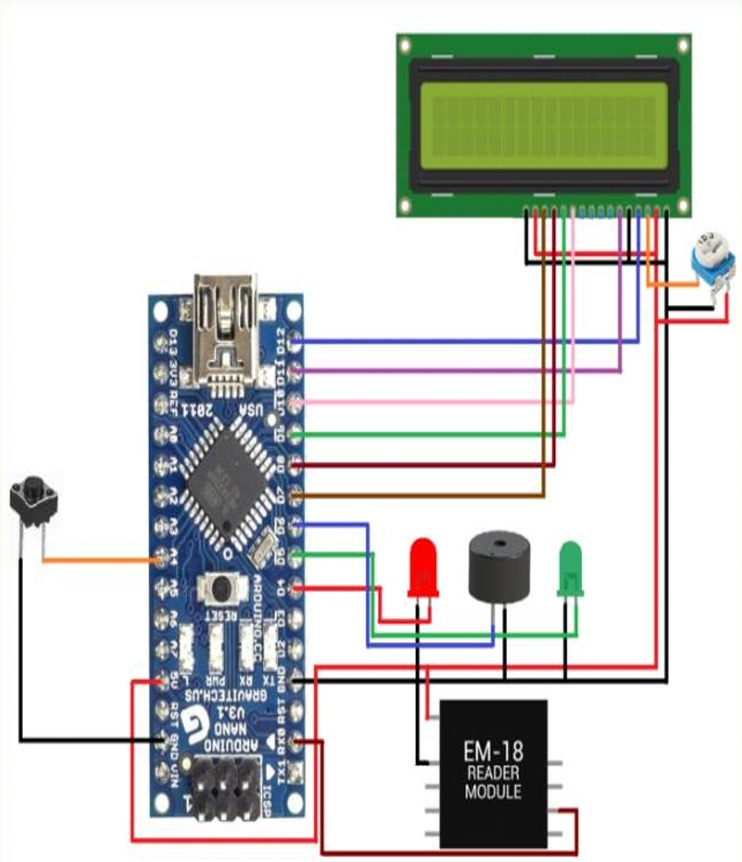
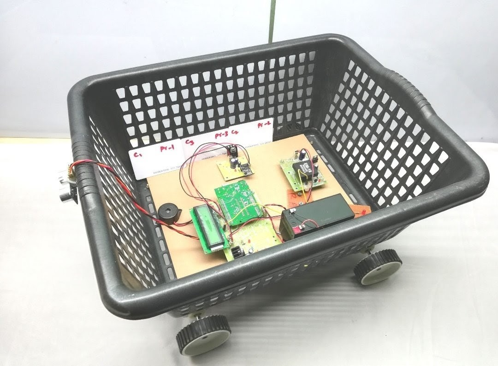

# Smart Shopping Trolley

An automated, IoT-enabled retail solution designed to eliminate traditional supermarket checkout queues, reduce customer waiting times, and optimize store management workflows.

---

## 📌 Project Overview & Problem Statement

### The Problem
Traditional checkout systems in supermarkets require manual barcode scanning at centralized front counters. During rush hours, this design creates significant bottlenecks, leading to long waiting queues, high human error rates, and frustrated customers.

### The Solution
This project introduces an intelligent shopping cart that handles billing on the fly. By incorporating RFID technology and a localized processing unit, the cart automatically detects products as they are placed inside, calculates a running total, and mirrors the data to a synchronized web server. This allows shoppers to view their digital receipts instantly and completely bypass front-counter lines.

---


## 📂 Project Documentation

To read the complete project proposal, methodologies, and academic scope, you can access the full official document here:

> 📄 **[Click Here to Read the Full Project Synopsis](./Synopsis.pdf)**

---

## 🛠️ Hardware Architecture & Component Description

The system utilizes a modular hardware design coordinated by a central processing unit:

*   **Arduino Nano Microcontroller:** Serves as the central "brain" of the cart, running the core firmware loop to process serial tag IDs, compute data, and trigger peripheral indicators.
*   **EM18 RFID Reader Module (125 kHz):** An embedded serial receiver that establishes a localized RF field (~5–10 cm range) inside the cart basket to scan product tags wirelessly via UART communication.
*   **Passive RFID Tags:** Attached to individual store items, containing unique identification numbers that function as a replacement for traditional physical barcodes.
*   **16x2 Alphanumeric LCD Display + I2C Interface:** Displays real-time billing metrics (item list, individual prices, running totals) directly to the customer while using only two communication pins (SDA/SCL).
*   **Audio-Visual Feedback System:** Uses a Piezo Buzzer alongside separate Red and Green LEDs to give immediate feedback (Green/Chirp for a valid item scan; Red/Alarm for system errors).
*   **Prototyping Framework:** All components share a common 5V rail and ground reference tracking, systematically mounted on a compact Zero PCB to ensure durability in a mobile cart environment.

---

## ⚙️ System Workflow & Circuitry

```text
+------------------+       +-------------------+       +--------------------+
|  Passive RFID    | ----> |  EM18 RFID Reader | ----> |   Arduino Nano     |
|   Product Tag    |       |      Module       |       |  Microcontroller   |
+------------------+       +-------------------+       +---------+----------+
                                                                 |
                                       +-------------------------+-------------------------+
                                       |                         |                         |
                                       v                         v                         v
                            +--------------------+    +--------------------+    +--------------------+
                            |   16x2 LCD Panel   |    |  Red / Green LEDs  |    |    Piezo Buzzer    |
                            |   (I2C Protocol)   |    | (Status Indicators)|    |  (Auditory Alerts) |
                            +--------------------+    +--------------------+    +--------------------+
```

| 🔌 Circuit Schematic | 🛠️ Hardware Prototype |
| :---: | :---: |
|  |  |
